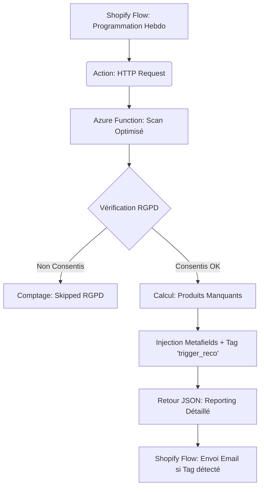

# Shopify Cross-Sell Automation (Azure Function + Flow)

Ce projet vise à automatiser l'envoi d'emails de cross-selling personnalisés pour les clients des boutiques TB Outdoor et TB1648, sans utiliser d'applications tierces payantes.

---

## 🚀 Le Concept

Lorsqu'un client achète un produit d'une collection spécifique (ex: collection Louis), le système attend un délai défini (ex: 6 mois) puis lui envoie un email récapitulant ses achats actuels et lui proposant 2 ou 3 produits complémentaires qu'il ne possède pas encore.

## 🏗 Architecture Technique

Le système repose sur trois piliers :
1. **Shopify Flow** : Le chef d'orchestre qui gère les triggers (événements), l'appel à l'Azure Function, et l'envoi final des emails via *Shopify Email*.
2. **Azure Function (Python)** : Le "cerveau" optimisé qui traite l'intégralité des commandes en un seul passage pour garantir rapidité et conformité RGPD.
3. **Shopify Metafields** : La "mémoire" du système qui stocke les recommandations personnalisées.



---

## 🛡️ RGPD & Sécurité

Le système intègre une vérification stricte du consentement marketing :
- **Filtrage automatique** : Seuls les clients ayant `email_marketing_consent.state == 'subscribed'` (ou `accepts_marketing == true`) sont traités.
- **Reporting** : Chaque scan retourne le nombre exact de clients ignorés pour cause de non-consentement (`skipped_rgpd`).
- **Zéro Email Non Sollicité** : Aucun tag n'est ajouté et aucune donnée n'est envoyée si le consentement n'est pas vérifié.

---

## ⚡ Optimisation des Performances

Le moteur a été refondu pour éviter les timeouts (limite de 60s de Shopify) :
- **Scan Unique** : Au lieu de plusieurs recherches par collection, le système récupère toutes les commandes de la fenêtre en une seule fois.
- **Reporting JSON** : La fonction renvoie un bilan complet à Shopify Flow :
  - `total_found` : Nombre total de commandes identifiées dans la fenêtre.
  - `updated` : Nombre de clients mis à jour avec succès (et emails envoyés).
  - `skipped_rgpd` : Nombre de clients éligibles mais non-abonnés.

---

## 📋 Organisation du Projet

### Structure des fichiers

```
.
├── azure_function/
│   ├── function_app.py       (Azure Function - point d'entrée)
│   ├── shopify_helper.py     (Helper API - cœur du système)
│   ├── requirements.txt      (Dépendances)
│   ├── host.json             (Config Azure)
│   ├── local.settings.json   (Config locale)
│   ├── .env                  (Secrets - NE PAS COMMITER)
│   ├── .funcignore           (Fichiers à ignorer)
│   └── tests/                🧪 TESTS & DEBUG
│       ├── test_recent_forges.py        (Clients 0-30j)
│       └── test_6months_validation.py  (Validation 6 mois)
│
├── Terraform/                 🏗️ INFRASTRUCTURE
└── README.md                  (Cette documentation)
```

---

## ⏰ LOGIQUE DE RELANCE (6 mois ±7 jours)

Le système recherche les clients ayant acheté **exactement 6 mois avant** :

- **Fenêtre** : 173 à 180 jours.
- **Pilotage** : Déclenché par le flux **"Programmation Cross-Selling"** dans Shopify Flow.
- **Contenu** : Cible les collections *Louis, Forgés, Brigade, Forgé Premium Evercut*.

### Exemple de flux
Si un client achète le **22 janvier 2025** :
- Le scan du **Lundi 21 juillet 2025** détectera le client.
- L'Azure Function injectera le tag `trigger_reco` et les recommandations dans les Metafields.

---

## 🏗️ Infrastructure (Terraform)

Le projet utilise **Terraform** pour provisionner et gérer automatiquement l'infrastructure sur Azure. Cela garantit une configuration reproductible et conforme aux standards de nommage.

### Ressources gérées
- **Resource Group** : Le conteneur logique (`rg-Shopify-CrossSelling-dev`).
- **Storage Account** : Pour le stockage interne de la fonction.
- **Service Plan** : Plan de consommation (Y1) pour minimiser les coûts.
- **Function App** : L'instance Linux hébergeant le code Python 3.11.

### Utilisation de Terraform
```bash
cd Terraform
terraform init
terraform apply -var-file="local.tfvars"
```

### Principaux fichiers
- `main.tf` : Définition des ressources Azure.
- `variables.tf` : Liste des variables configurables (Location, Environment, etc.).
- `local.tfvars` : Fichier local (non commité) contenant les secrets.

---

## 🚀 Utilisation & Déploiement

### Déploiement
```bash
cd azure_function
func azure functionapp publish func-Shopify-CrossSelling-dev
```

---

## ✅ Checklist Final
- [x] Structure de fichiers standard V2 Azure.
- [x] Logging de diagnostic détaillé pour les recommandations.
- [x] Reporting RGPD intégré et visible dans Shopify Flow.
- [x] Optimisation contre les timeouts (Scan unique).
- [x] Infrastructure Terraform déployée dans North Europe.

**Dernière mise à jour :** 18 février 2026
**Version :** 2.5.0
